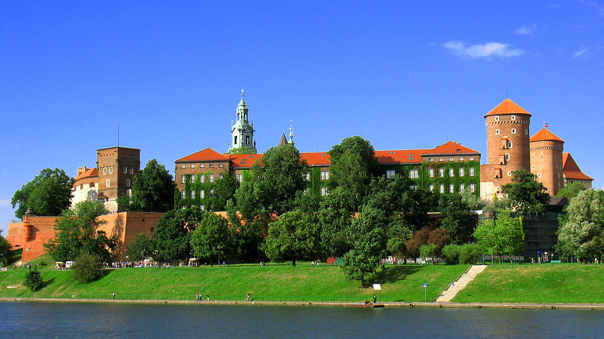
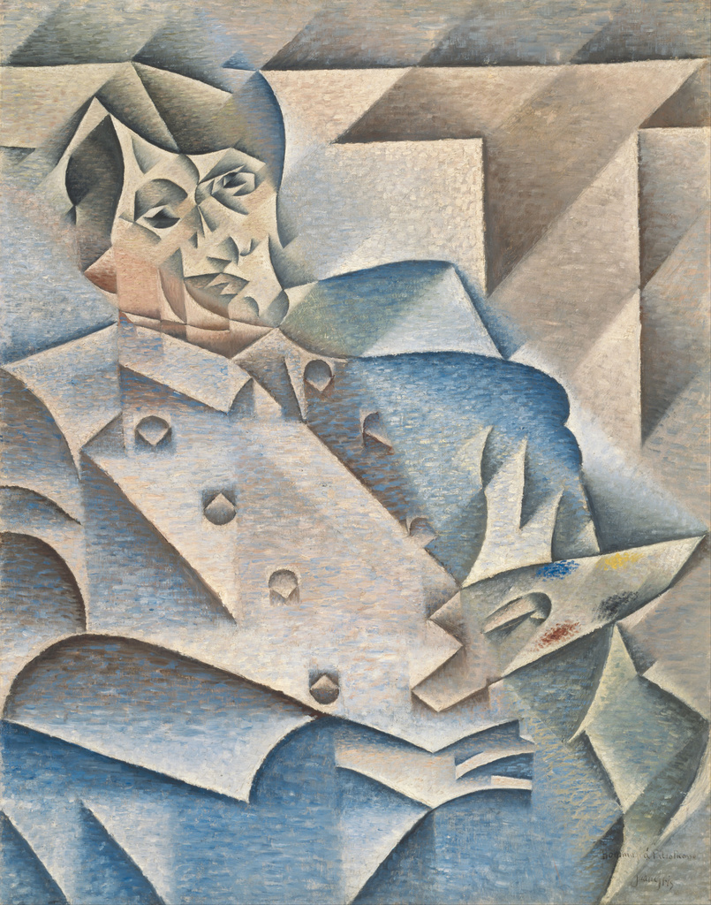
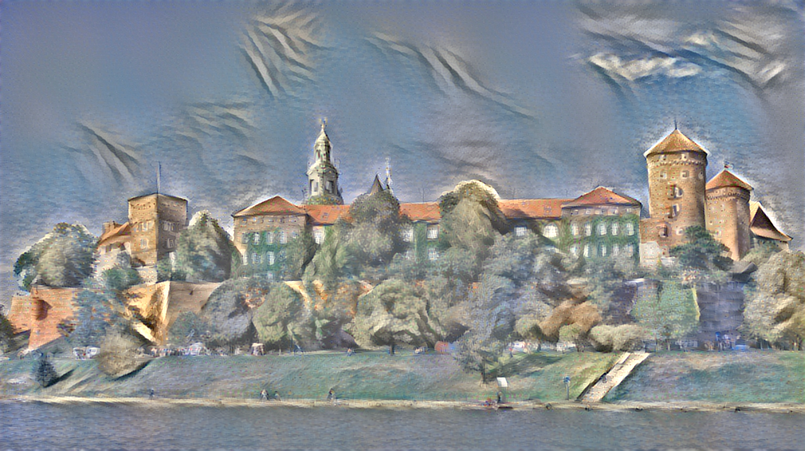

# style_transfer

A simple TensorFlow implementation of the paper 
[A Neural Algorithm of Artistic Style](https://arxiv.org/abs/1508.06576)
by Gatys et al.

## Running

It works with both python 2 and 3. In order to run:
1. `pip install -r requirements.txt` (or `pip install -r requirements-cpu.txt` if you run on CPU).
1. `python main.py --content CONTENT_FILE --style STYLE_FILE [--output OUTPUT_FILE] [--gif GIF]` 
(to use default parameters).

To see all possible options, run `python main.py -h`.

## Examples

content:

style:

output:

